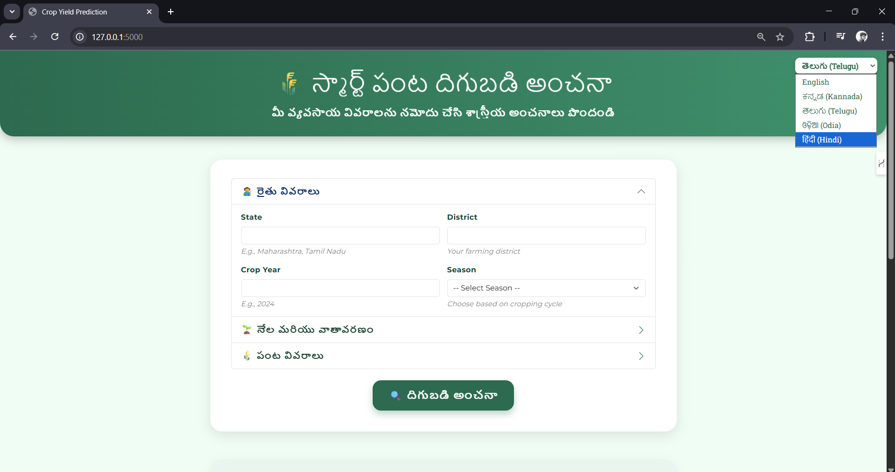
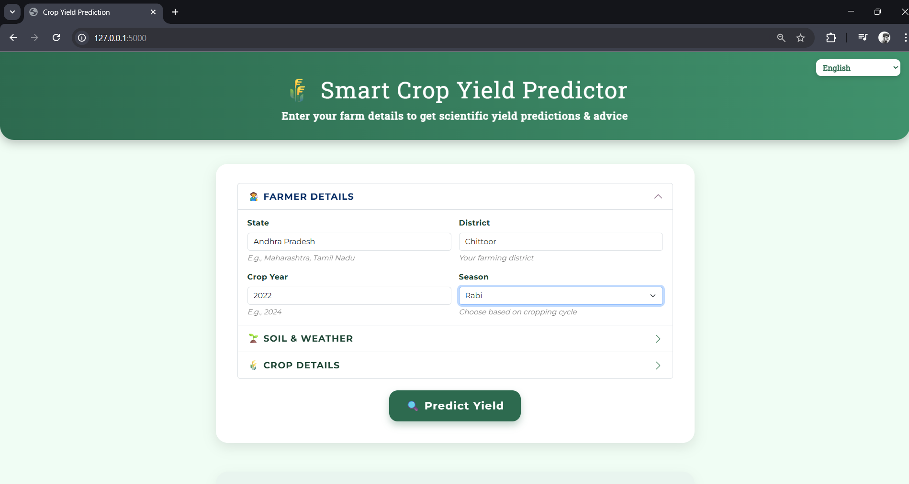
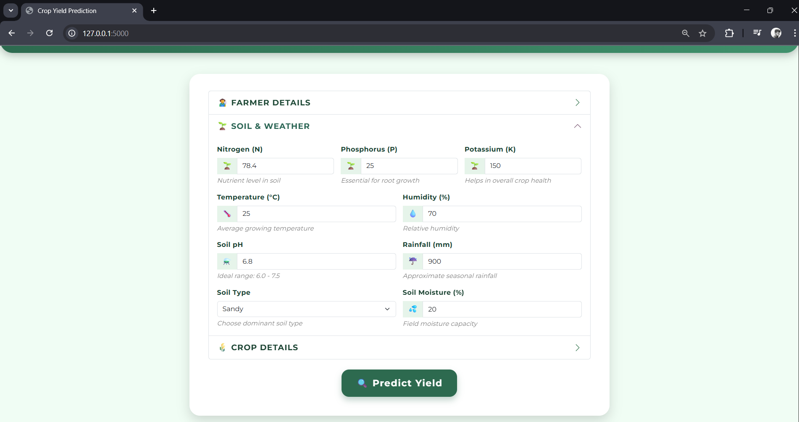
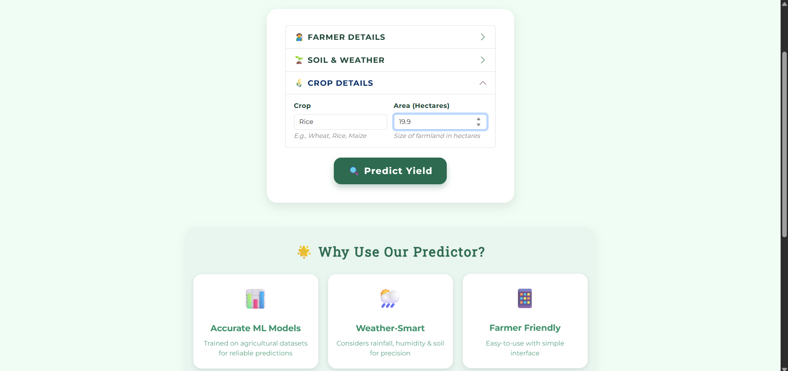
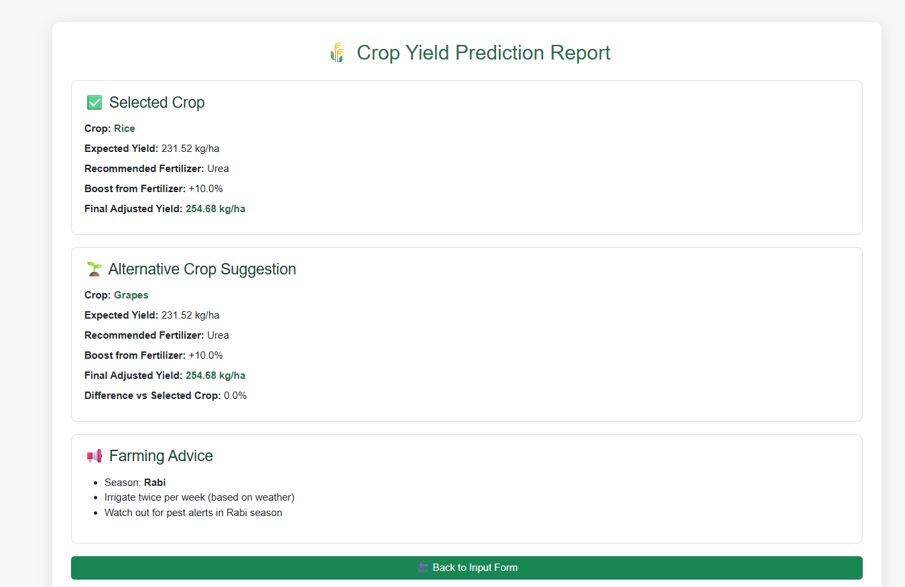

# 🌾 Smart Crop Yield Prediction System  

# AI-Powered-crop-yield-production
AI-Powered Crop Yield Prediction is a machine learning project that leverages soil health, weather conditions, and seasonal data to predict crop yields with high accuracy. It helps farmers and researchers make data-driven decisions on irrigation, fertilization, and resource management to optimize agricultural productivity.


[](https://www.python.org/)  
[](https://flask.palletsprojects.com/)  
[](https://reactjs.org/)  
[](LICENSE)  

🚀 A *machine learning-powered platform* that predicts *crop yields* and provides:  
✅ *Irrigation Guidance*  
✅ *Fertilizer Recommendations*  
✅ *Pest/Disease Alerts*  
✅ *Next-Season Crop Suggestions*  

Built with ❤ for *Hackathon GITAM 2025*.  

---

## ✨ Features
- 📊 Predicts *crop yield (kg/ha and q/acre)* using *state, district, and land size*  
- 🌍 District-specific *crop filtering* using production datasets  
- 🌱 Provides *actionable agriculture guidelines*  
- ⚡ *REST API* built with *Flask*  
- 🖥 *Interactive Frontend* (React or HTML)  
- 🔗 Pipeline: *CSV → Data Cleaning → ML Model → API → UI*  

---

## 📂 Project Structure  
```
plaintext
HACKATHON-GITAM-2025/
│
├── api/                 # Backend Flask API
│   ├── api.py           # Flask routes
│   ├── predict.py       # Prediction logic
│
├── data_raw/            # Raw datasets
│   ├── Crop_recommendation.csv
│   ├── fertilizer_recommendation.csv
│
├── processed_data/      # Cleaned datasets
│   ├── processed_production_clean.csv
│
├── mapping/             # Guidelines & mappings
│   ├── crop_guidelines.json
│
├── model/               # Trained ML models
│   ├── yield_model.pkl
│
├── scripts/             # Training + Data scripts
│   ├── train_crop_model.py
│   ├── train_yield_model.py
│   ├── build_guidelines.py
│
├── frontend/            # React/HTML frontend
│
├── test_api.py          # Local API testing
├── requirements.txt     # Dependencies
├── README.md            # 📘 Documentation
```


## ⚙ Installation & Setup

### 1️⃣ Clone Repo
```
bash
git clone https://github.com/your-username/crop-yield-prediction.git
cd crop-yield-prediction
```

### 2️⃣ Create Virtual Environment*
*Linux / Mac*
```
python -m venv venv
source venv/bin/activate
```
*Windows*
```
python -m venv venv
venv\Scripts\activate
```

### 3️⃣ Install Dependencies*
```
pip install -r requirements.txt
```

### 4️⃣ Train Models (optional)*
```
python scripts/train_yield_model.py
python scripts/build_guidelines.py
```
### 5️⃣ Run Backend API*
```
python api/api.py
```

## The API will start at:
```
👉 http://127.0.0.1:5000
```
## 📡 API Usage
*Health Check*
```
curl http://127.0.0.1:5000/
```
## 🌱Predict Yields
```
curl -X POST http://127.0.0.1:5000/predict/json \
  -H "Content-Type: application/json" \
  -d '{"state":"Andhra Pradesh","district":"Kurnool","land_acres":10}'
```

*🔹 Example Response:*
```
[
  {
    "Crop": "Paddy",
    "Predicted Yield (kg/ha or q/acre)": "3200 kg/ha (32 q/acre)",  
    "Irrigation Guidance": "Maintain 2–5 cm standing water during growth",
    "Fertilizer Recommendation": "N: 35 kg, P: 0 kg, K: 0 kg per hectare",
    "Pest/Disease Alerts": "Stem borer risk (high humidity)",
    "Productivity Gain (%)": "+12% with optimized practices",
    "Best Crop Suggestion (Next Season)": "Maize (better yield in Rabi)"
  }
]
```
## 💻 Frontend

*We provide both React and HTML frontend options.*
```
React Setup
cd frontend
npm install
npm start
```
*Plain HTML*

Open frontend/index.html in browser.
```
It calls http://127.0.0.1:5000/predict/json.
```
## 📊 Tech Stack
```
Python (Flask, Pandas, scikit-learn, Joblib) → Backend + ML
React.js / HTML + JS → Frontend
CSV datasets → Agriculture data (crop production, fertilizer, yield)
```
## 📌 Future Scope
🌍 Real-time weather & soil sensor integration
📡 Deploy API to cloud (AWS / Azure / GCP)
📱 Mobile app integration for farmers
🧠 Improve ML model with LSTM or XGBoost

## 👨‍💻 Contributors

Member 1 → Data Cleaning & Preprocessing
Member 2 → Model Training & Guidelines
Member 3 → Backend API
Member 4 → Frontend Development

## 🏆 Hackathon

Project developed for Hackathon GITAM 2025.
Empowering farmers with data-driven crop decisions 🌱.

## 📷 Sample Outputs

### 🌐 Homepage (Frontend UI)
 

 


### 📊 Prediction Result Page

